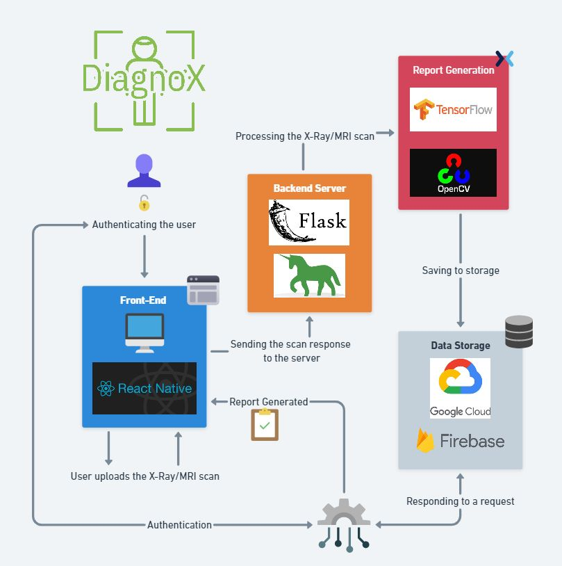
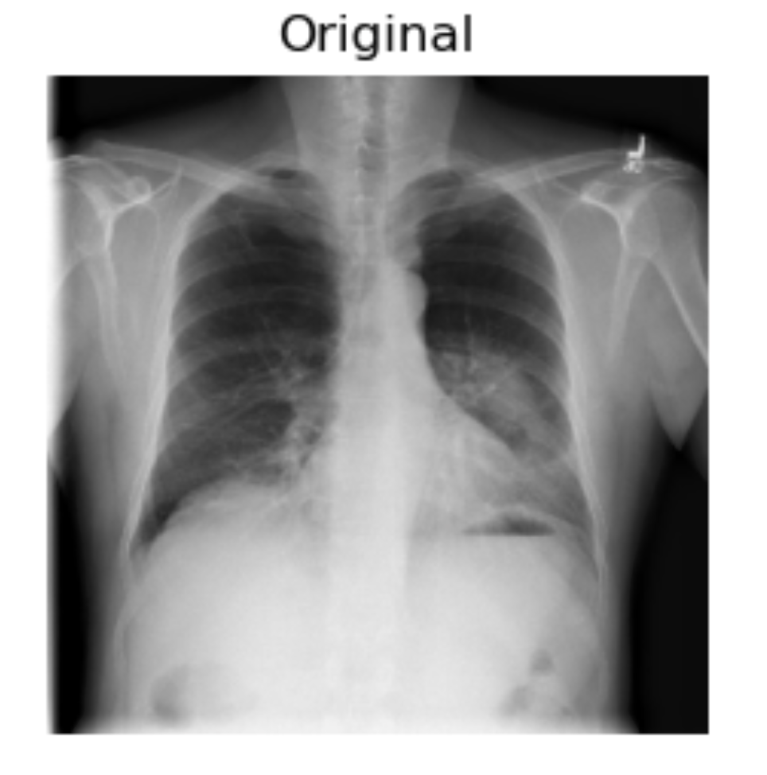
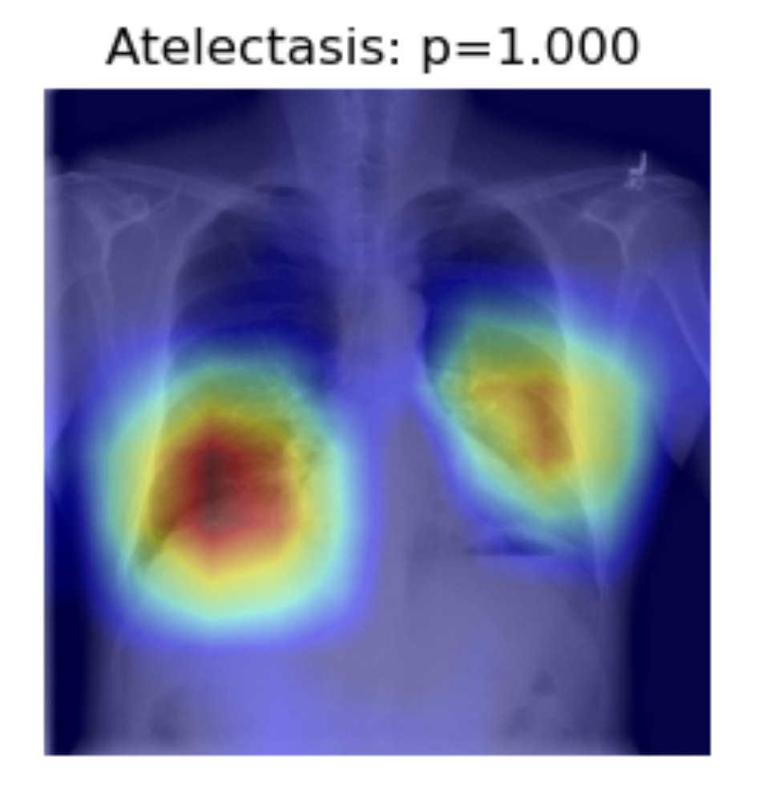
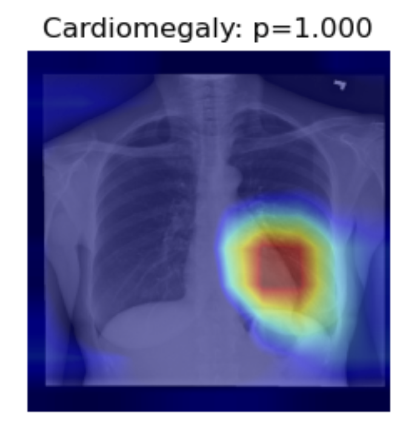
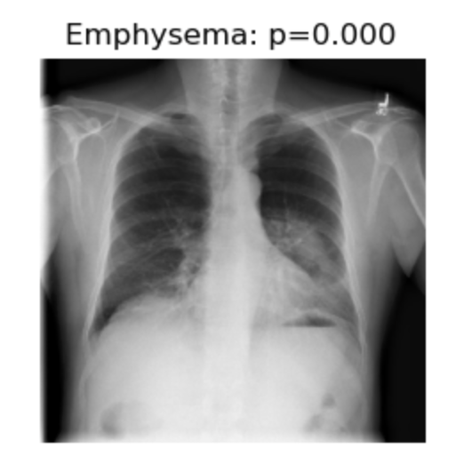
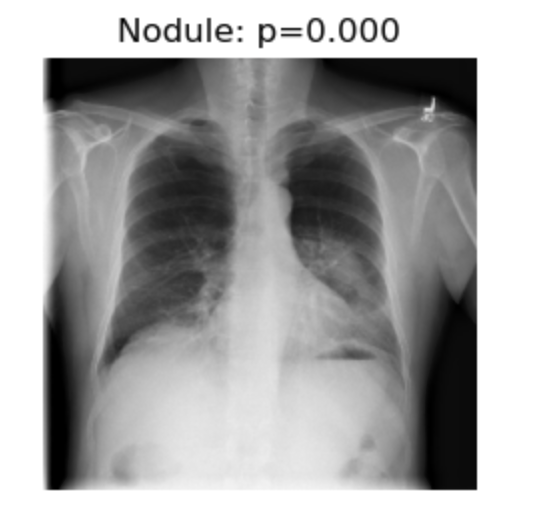

# DiagnoX
## Steps to Access the App
To access our application you can either download the [android application]().

- [Backend API Postman Documentation](https://documenter.getpostman.com/view/18833270/UVeAtoRi)
- [Android App](https://github.com/harshjadon9/XSpam-Frontend/blob/main/android/app/release/XSpam.apk)
- [Google Slides Presentation](https://docs.google.com/presentation/d/1VxxluxgWW_ybU4xPmC5XAu8mPKcrk6lv/edit#slide=id.g83372e3e9c_0_0)
- [Video Demonstration](https://drive.google.com/file/d/1FPoRCECrZcSqU0Shb-bBs8sFwb-31hp5/view?usp=sharing)

### Backend Link
**[Link](https://github.com/Hackstreet-Zone/DiagnoX)**

## Motivation 
X-rays are a commonly used diagnostic tool in medical settings. They are used to visualize the internal structure of the body and help doctors diagnose various diseases and conditions. However, the interpretation of X-rays can be challenging and requires a high level of expertise. Misinterpretation of X-rays can lead to misdiagnosis and delay in treatment, resulting in further complications.

To address this issue, DiagnoX was developed to assist doctors in interpreting X-rays. It uses advanced machine learning algorithms to analyze X-rays and provide a preliminary diagnosis. This preliminary diagnosis is presented to the doctor, who can then confirm or modify it based on their own expertise.

## ❓ Problem Statement
To develop app for medical professionals who have a limited amount of time to review and analyze X-ray or MRI scans, which can lead to misdiagnosis or missed diagnoses. Improving the traditional methods of generating reports for X-ray or MRI scans can be time-consuming and labor-intensive. To help the patients in remote or underserved areas may have difficulty accessing healthcare services, including the expertise needed to analyze X-ray or MRI scans.

## 🥸 Description
To address this issue, DiagnoX was developed to assist doctors in interpreting X-rays. It uses advanced machine learning algorithms to analyze X-rays and provide a preliminary diagnosis. This preliminary diagnosis is presented to the doctor, who can then confirm or modify it based on their own expertise.

DiagnoX is designed to be highly user-friendly, with a simple interface that can be easily integrated into a hospital's existing system. The system is also highly customizable, allowing doctors to modify the algorithms and criteria used for diagnosis based on their preferences.

## 👌 What it does/ Features:
- Get diagnosed X-Rays with pre-diagnosis through deep-learning model
- Get prognosis and chances if you can die in the next 10 years or not through official hospital reports.
- Get recommendation for users to visit nearby doctors.
- Easy to understand Minimilastic and Interactive UI/UX Design 

## Proposed Approach:

## Mockups
<table>
    <tr>
        <td></td>
        <td></td>
    </tr>
    <tr>
        <td></td>
        <td></td>
        <td></td>
    </tr>
</table>

## Tech Stack
React Native, Python, Flask, Tensorflow, GCP, Git, Numpy, Pandas, Scikit, Matplotlib
Technologies : Deep Learning, DenseNet121

## Steps to run locally
Clone the repo in your local machine and setup python and flutter environment. Create .env file similar to .env.sample file with all the required fields.

### Mobile Application
1. Go into `app/` directory by doing `cd app` in terminal.
2. Configure firebase for android by folllowing the [doumentation](https://firebase.flutter.dev/docs/installation/android/).
3. Write `flutter run` in the terminal to start the application.

### Flask Server
1. Install all the required packages in python virtual enviroment `pip install -r requirements.txt`
2. Run `python app.py` in the root directory of the project.

## Contributors
- [Harsh Jadon](https://github.com/harshjadon9)
- [Karnik Kanojia](https://github.com/karnikkanojia)
- [Shreedhar Hegde](https://github.com/mavenor)
- [Sagar Reddy](https://github.com/TheGoldenFang)
